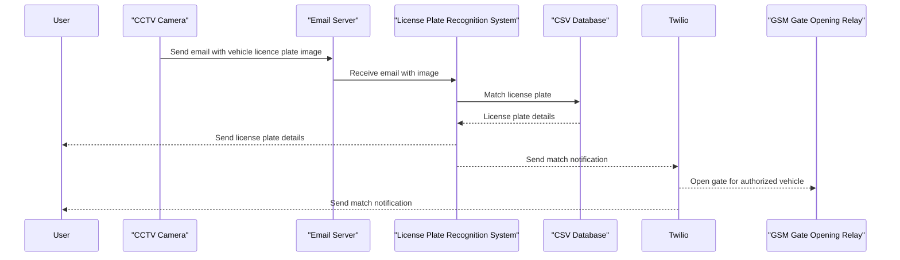

# License Plate Recognition Gate Control System

## Overview

The License Plate Recognition Gate Control System automates the recognition of vehicle license plates from images attached to incoming emails from CCTV cameras. It uses the Plate Recognizer API for plate recognition and performs matching against a CSV database of authorized license plates. When a match is found, the system sends email notifications and, if applicable, makes Twilio calls to a GSM Gate Opening Relay device to grant access to authorized vehicles.

## How It Works



1. **Email Processing**: The system is triggered by incoming emails with attached images of license plates. It downloads the email content from a designated S3 bucket.

2. **Plate Recognition**: It utilizes the Plate Recognizer API to recognize the license plate number from the attached image.

3. **Database Matching**: The system then compares the recognized license plate against a CSV database of authorized license plates. Due to the inaccuracy of plate recognition, it performs both exact and fuzzy matching to find potential matches.

4. **Notifications**: When an exact or fuzzy match is found, a phone call is placed to a GSM Gate Opening relay device phone number using the Twillio API which can open a gate, unlock a door etc. An email with a thumbnail image attachment is also sent to a defined email recipient.

5. **Logging**: The system logs its actions and any errors to AWS Cloudwatch logs which can be used for troubleshooting.

## How to Install and Update

1. **Dependencies**:
   - Ensure you have the necessary AWS credentials configured and services configured, refer to sample policy file 'sample_aws_policy.json' for AWS lambda.
   - Create a Plate Recognizer account and obtain an API token for plate recognition.
   - Create a Twilio account and obtain the required credentials (Account SID and Auth Token).
   - Setup a GSM Gate Opener relay device and associated phone number e.g.
     - http://rtu5024.com
     - https://gatesim.ie/

2. **Configuration**:
   - Set up an AWS Lambda function with this code.
   - Configure the following parameters at the top of the script:
     - `plate_recognizer_token`: Your Plate Recognizer API token.
     - `ses_sender_email`: Your SES sender email address.
     - `ses_email_notification_to`: The email address where notifications will be sent.
     - `twilio_account_sid`: Your Twilio Account SID.
     - `twilio_auth_token`: Your Twilio Auth Token.
     - `twilio_from_phone_number`: Your Twilio phone number.
     - `twilio_to_phone_number`: The phone number where Twilio calls will be made.
     - `s3_bucket_name`: The name of your S3 bucket containing authorized license plates.
     - `s3_file_key`: The key (path) to the CSV file containing authorized license plates.
     - `fuzzy_match_threshold`: Threshold for fuzzy matching (adjust as needed).

3. **Upload CSV Database

Upload a CSV file to an Amazon S3 bucket containing the authorized license plate numbers and their corresponding vehicle owners' information. Here's an example CSV file with anonymized data:

```csv
"Plate", "Name", "Colour", "Make", "Model"
"ABC123", "John Doe", "Red", "Toyota", "Camry"
"XYZ789", "Jane Smith", "Blue", "Honda", "Civic"
"DEF456", "Bob Johnson", "Silver", "Ford", "Focus"
"GHI789", "Alice Brown", "Black", "Chevrolet", "Malibu"
```

4. **Deployment**:
   - Create an AWS Lambda function and upload this code.
   - Set up an S3 trigger to invoke the Lambda function when new emails are received.

5. **Testing and Monitoring**:
   - Test the Lambda function by sending emails with attached license plate images.
   - Monitor AWS CloudWatch logs for any issues.

6. **Updates**:
   - To update the code, modify the Lambda function with the latest code.
   - Ensure your dependencies and configurations remain up-to-date.

## Automated Deployments with GitHub Actions

To automate deployments, you can use GitHub Actions you can use the supplied GitHub Actions workflow file (e.g., .github/workflows/deploy-lambda.yml), you will need to configure the following GitHub secrets

AWS_REGION:
AWS_ACCESS_KEY_ID: 
AWS_SECRET_ACCESS_KEY:


## Conclusion

That's it! You now have an automated License Plate Recognition Gate Control System to enhance your security and notification systems. Feel free to customize and adapt the system to your specific use case and requirements.

For more details and technical information, refer to the code and documentation in this GitHub repository.

*Note: This README is intended for non-technical readers. For detailed technical documentation and code, refer to the GitHub repository.*

**Maintained by: Ciaran Finnegan**
**Contact: https://github.com/ciaran-finnegan**
